# Hi there, I'm Prashant Karna! 👋

<!-- Theme-Sensitive Header Banner -->
<picture>
  <source media="(prefers-color-scheme: dark)" srcset="readmefile/dark.svg">
  <source media="(prefers-color-scheme: light)" srcset="readmefile/light.svg">
  
</picture>

<!-- Live Interactive Telemetry Badges -->

  
  &nbsp;&nbsp;
  

 

## 🚀 About Me
I’m **Prashant Karna**, a **Software Engineer** and **Backend & AI Developer** specializing in **Python, Django, FastAPI, cloud infrastructure (AWS/Azure)**, and scalable software systems. 

Experienced in designing and deploying production-ready REST APIs, microservices, and AI-powered platforms. Currently building intelligent Call and Chat systems leveraging **Large Language Models (LLMs), Retrieval-Augmented Generation (RAG), LangChain, AI agents**, and modern automation workflows.

> 💡 *"Engineering robust backends and intelligent AI systems to turn complex challenges into seamless digital solutions."*

- 💼 **Current Role:** Python & AI Developer | Python & Django Mentor
- 🎓 **Education:** Bachelor of Computer Science and Engineering (CGPA: 3.76/4.00)
- 💬 **Ask me about:** LLMs & RAG, AI Agents, Python/Django Architecture, AWS/Azure Cloud & Microservices
- ✉️ **Email:** [prashantkarna21@gmail.com](mailto:prashantkarna21@gmail.com)
- 💼 **LinkedIn:** [linkedin.com/in/imprashant98](https://linkedin.com/in/imprashant98)
- 🐙 **GitHub:** [github.com/imprashant98](https://github.com/imprashant98)

---

## 🛠️ Technical Skills

### 🧠 Backend & AI Engineering

### ☁️ Cloud & DevOps

### 🗄️ Databases & Caching

### 🔧 Tools & Architecture

---

## 💼 Experience & Key Highlights

### 🔹 **Python & AI Developer** — *Lyra Logics* `(July 2025 – Present)`
- **Intelligent Call & Chat Systems:** Architected real-time context-aware communication systems using **LLMs, RAG, and LangChain**.
- **Scalable Microservices:** Designed and implemented production-grade REST APIs and backend microservices integrating AI capabilities into enterprise workflows.
- **Cloud Infrastructure & DevOps:** Managed cloud deployments, automated CI/CD pipelines, and implemented centralized monitoring/logging for high reliability.
- **Performance Optimization:** Optimized database query efficiency, caching strategies, and asynchronous task execution to minimize API response times.

### 🔹 **Junior Software Developer** — *Vrit Technologies* `(July 2024 – July 2025)`
- **SaaS Backend Platform:** Built scalable multi-tenant SaaS backends using **Django, DRF, PostgreSQL, and MySQL**.
- **Serverless & Async Workloads:** Automated CI/CD pipelines and leveraged **AWS Lambda & SQS** for decoupled background tasks and serverless compute.
- **Infrastructure & Monitoring:** Streamlined cloud resources across **AWS and Azure**, optimizing database schemas and system caching.

---

## 🏆 Publications & Leadership

- 📄 **Research Publications:**
  - *Depression Detection using TF-IDF & N-grams* — **Springer** (2023)
  - *BERT-driven Depression Detection* — **IEEE Xplore, ICOTL** (2023)
- 👨‍🏫 **Mentorship:** Mentored aspiring developers in Python and Django at **Skillshikshya** (2024–Present).
- 🌐 **Leadership:** Served as **Head of Foreign Affairs**, Model UN Association (MUNA), HSTU (2020).
- 🏅 **Academic Honors:** Recipient of the **Dean’s Scholarship Award** for academic excellence (2018, 2023).

---

## 📈 GitHub Stats & Metrics

<!-- Sleek contribution activity graph with theme sensitivity -->

  <picture>
    <source media="(prefers-color-scheme: dark)" srcset="https://github-readme-activity-graph.vercel.app/graph?username=imprashant98&bg_color=030712&color=94A3B8&line=10B981&point=34D399&area_color=0D9488&area=true&hide_border=true&radius=12">
    <source media="(prefers-color-scheme: light)" srcset="https://github-readme-activity-graph.vercel.app/graph?username=imprashant98&bg_color=FFFFFF&color=475569&line=0D9488&point=10B981&area_color=E6FFFA&area=true&hide_border=true&radius=12">
    
  </picture>

<!-- Side-by-Side Stats Cards with theme sensitivity -->

  <!-- GitHub Stats Card -->
  <picture>
    <source media="(prefers-color-scheme: dark)" srcset="https://ghstats.dev/api/card?username=imprashant98&bg=030712&title_color=10B981&text=94A3B8&icon_color=34D399&border_color=0D9488">
    <source media="(prefers-color-scheme: light)" srcset="https://ghstats.dev/api/card?username=imprashant98&bg=FFFFFF&title_color=0D9488&text=475569&icon_color=10B981&border_color=E2E8F0">
    
  </picture>
  
  <!-- Top Languages Card -->
  <picture>
    <source media="(prefers-color-scheme: dark)" srcset="https://ghstats.dev/api/langs?username=imprashant98&layout=grid&bg=030712&title_color=10B981&text=94A3B8&icon_color=34D399&border_color=0D9488">
    <source media="(prefers-color-scheme: light)" srcset="https://ghstats.dev/api/langs?username=imprashant98&layout=grid&bg=FFFFFF&title_color=0D9488&text=475569&icon_color=10B981&border_color=E2E8F0">
    
  </picture>

<!-- Streak Stats with theme sensitivity -->

  <a href="https://github.com/imprashant98" target="_blank">
    <picture>
      <source media="(prefers-color-scheme: dark)" srcset="https://streak-stats.demolab.com?user=imprashant98&theme=dark&background=030712&stroke=0D9488&ring=10B981&fire=34D399&currStreakNum=10B981&currStreakLabel=94A3B8&sideNums=94A3B8&sideLabels=94A3B8&dates=6B7280">
      <source media="(prefers-color-scheme: light)" srcset="https://streak-stats.demolab.com?user=imprashant98&theme=light&background=FFFFFF&stroke=E2E8F0&ring=0D9488&fire=10B981&currStreakNum=0D9488&currStreakLabel=475569&sideNums=475569&sideLabels=475569&dates=94A3B8">
      
    </picture>
  </a>

---

  ⭐ <b>If you like this profile, feel free to connect or leave a star!</b> ⭐

---

  Developed with 💚 by <a href="https://github.com/imprashant98" target="_blank"><b>Prashant Karna</b></a> 
  Building high-performance backends and intelligent AI solutions.

